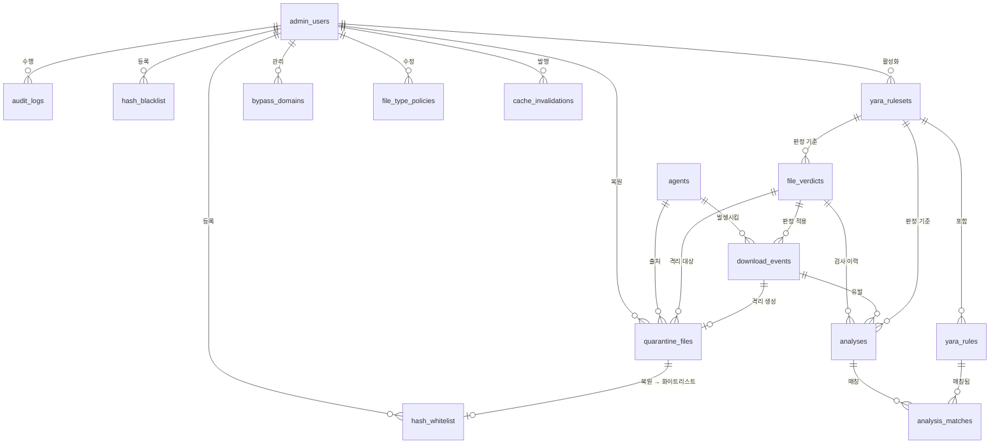

# ERD 리뷰 및 수정안 (전체 스키마)

- 날짜: 2026-09-17
- 목적: 초안 ERD(7개 테이블)를 제품 설계·배포 아키텍처와 대조해 문제점을 정리하고, **5주 전체 기능
  기준의 수정 ERD**를 확정한다. MVP 기준이 아니라 최종 목표 스키마다.
- 관련 문서:
  [`프록시-악성코드-탐지-플랫폼.md`](../../../프록시-악성코드-탐지-플랫폼.md) (제품 설계),
  [`2026-09-12-deployment-architecture-design.md`](2026-09-12-deployment-architecture-design.md) (배포/인프라 — RDS·S3·Redis 역할),
  [`2026-09-15-architecture-review-and-5week-plan.md`](2026-09-15-architecture-review-and-5week-plan.md) (인증·오탐 복원·PC 현황 지적),
  [`2026-09-13-mvp-scope.md`](2026-09-13-mvp-scope.md) (4일 MVP 범위 — 이 문서보다 좁음)
- 복사용 DDL: [`docs/schema/schema.sql`](../../schema/schema.sql) — ERD 툴 붙여넣기용 단독 파일.
  3장 DDL과 **내용이 동일**하며, 한쪽만 고치면 안 된다

---

## 0. 한눈에 보기

| 항목 | 초안 ERD | 수정안 |
|---|---|---|
| 판정의 귀속 대상 | 다운로드 인스턴스(`spool_files.file_id`) | **파일 해시(`file_verdicts.sha256`)** + 인스턴스별 이력 분리 |
| 해시 기반 캐시 | 불가능 | 가능 (`file_verdicts`가 캐시 원천) |
| 스풀 경로 저장 위치 | 서버 RDS | **에이전트 인메모리** (서버에서 제거, DB 자체를 두지 않음) |
| 격리 파일 저장 | `storage_path` (모호) | **S3 버킷 + 키** (배포 문서 확정 사항 반영) |
| 화이트리스트 | 없음 | `hash_whitelist` (블룸 필터 앞단 별도 레이어) |
| YARA 룰/룰셋 | 없음 | `yara_rulesets` + `yara_rules` + `analysis_matches` |
| 정책(바이패스·검사수준) | 없음 | `bypass_domains` + `file_type_policies` |
| 오탐 복원 | 기록 불가 | `quarantine_files.status/restored_by/restored_at` |
| `admin_users` 연결 | FK 0개(고립) | 복원·리스트·정책·룰셋·감사로그에 연결 |
| 테이블 수 | 7 | 15 (서버 RDS만. 에이전트 측 DB 없음 — 5장) |

---

## 1. 초안 ERD의 문제 (요약)

상세 근거는 대화에서 다뤘고, 여기서는 수정안이 무엇을 해결하는지 기준으로만 남긴다.

### 치명적

1. **판정이 해시가 아니라 다운로드 인스턴스에 귀속** — `verdicts.file_id → spool_files`. 이 구조로는
   "해시 조회 → 캐시 히트" 자체가 성립하지 않는다. 제품 설계 4장의 핵심 흐름과 10장의 캐시 히트율
   지표가 모두 불가능해진다.
2. **클라이언트 자산과 서버 DB 혼재** — `spool_files.spool_path`는 사용자 PC의 경로다. 중앙 RDS에
   넣으면 조회 주체가 없고, 판정 직후 삭제되므로 대부분 죽은 데이터가 된다.
3. **화이트리스트 레이어 부재** — 제품 설계 6장 "블룸 필터는 삭제 불가하므로 화이트리스트를 별도
   레이어로 분리"가 반영돼 있지 않다. `blacklist`에 `active` 플래그도 없어 잘못 등록한 해시를
   행 삭제 외에는 해제할 수 없다.
4. **오탐 복원 기록 불가** — `quarantine_files`에 상태/복원자/복원시각이 없다. 제품 설계 3장의
   "격리 파일 관리 및 오탐 복원"이 동작할 수 없다.
5. **`admin_users`가 어떤 FK에도 참여하지 않음** — 감사 추적이 전무하다.

### 논리 오류

6. **`not null` 남발** — `content_disposition`(상당수 다운로드에 없음), `file_size`(chunked 응답은
   Content-Length 자체가 없음), `yara_matched`(해시 히트로 조기 판정 시 YARA 미실행),
   `last_heartbeat_at`(등록 직후)은 모두 NULL이 나온다.
7. **카디널리티가 전부 1:N인데 의미상 1:1** — 유니크 제약이 없어 재검사와 정상 흐름이 구분되지 않는다.
8. **`download_event.status`와 `verdicts.verdict` 이중 진실** — "차단됐나"를 두 곳에서 표현할 수 있어
   불일치가 발생한다. enum 정의도 없다.
9. **판정 재현성·캐시 무효화 불가** — 어떤 룰이 매칭됐는지, 어떤 룰셋 버전으로 판정했는지가 없다.
   `yara_matched` 불리언 하나뿐이라 Phase 4의 "캐시 무효화 채널"이 전량 무효화밖에 못 한다.
10. **에이전트 인증 수단 없음** — `agent_id`를 에이전트 자기 주장으로 받으면 이벤트 위조가 가능하다
    (아키텍처 리뷰 3.1의 인증 지적과 동일한 문제).

### 누락

11. 정책 테이블 전무 (파일 타입별 검사 수준, 바이패스 도메인, 보류 타임아웃, N MB 초과 정책)
12. 성능 지표용 타임스탬프 없음 — p99 지연·오버헤드·캐시 히트율을 집계할 컬럼이 없다
13. 격리 파일 메타데이터 부족 (원본 파일명, 해시, 소유 에이전트, 보관 만료일)
14. `blacklist`에 해시 알고리즘 구분 없음 (제품 설계 9장의 TLSH 퍼지 해싱 확장 불가)

### 초안에서 잘 잡은 것

- **`agent` 테이블의 존재** — 아키텍처 리뷰 3.4에서 "여러 PC를 구분하려면 에이전트 등록/기기 ID/
  하트비트가 필요한데 아직 어느 설계 문서에도 없다"고 지적된 공백을 초안이 먼저 메웠다. 수정안도
  이 테이블을 그대로 계승한다.
- `download_event`에 `mime_type` / `content_disposition`을 둔 것 — 다운로드 판별 근거를 남기는 건
  옳은 판단이다. NULL 허용만 고치면 된다.

---

## 2. 수정 ERD

### 2.1 다이어그램



### 2.2 테이블 역할

| # | 테이블 | 역할 | 도입 시점 |
|---|---|---|---|
| 1 | `admin_users` | 콘솔 계정 | 3주차 |
| 2 | `agents` | 에이전트 등록·하트비트·토큰 | 2주차 |
| 3 | `yara_rulesets` | 룰셋 버전 (활성 1개) | 2주차 |
| 4 | `yara_rules` | 개별 YARA 룰 | 2주차 |
| 5 | **`file_verdicts`** | **해시 단위 판정 캐시 — 스키마의 중심** | 1주차 |
| 6 | `download_events` | 다운로드 1건의 파이프라인 이력·성능 지표 | 1주차 |
| 7 | `analyses` | 탐지 엔진 실행 1회의 기록 (성공/타임아웃/크래시 포함) | 2주차 |
| 8 | `analysis_matches` | 어떤 룰이 매칭됐는가 | 2주차 |
| 9 | `hash_blacklist` | 알려진 악성 해시 | 1주차 |
| 10 | `hash_whitelist` | 오탐 복원·예외 (블룸 필터 앞단) | 3주차 |
| 11 | `quarantine_files` | S3 격리 보관 + 복원 상태 | 2주차 |
| 12 | `bypass_domains` | 바이패스 도메인 | 3주차 |
| 13 | `file_type_policies` | 타입별 검사 수준, N MB 초과 정책 | 4주차 |
| 14 | `cache_invalidations` | 캐시 무효화 채널 (서버 → Redis/에이전트) | 4주차 |
| 15 | `audit_logs` | 관리자 행위 감사 | 3주차 |

> `spool_files`는 서버 스키마에서 **삭제**한다. 에이전트 인메모리 상태로만 관리하며, 이를 대체할
> 로컬 DB를 두지 않는다 (5장 참고).

---

## 3. DDL (PostgreSQL)

생성 순서는 FK 의존 순서다.

> ERD 툴에 붙여넣으려면 [`docs/schema/schema.sql`](../../schema/schema.sql)을 쓰는 게 편하다.
> 같은 스키마를 `CREATE TABLE` / `ALTER` / `INDEX` / `COMMENT` 섹션으로 분리하고 FK를 테이블 레벨
> 명시형(`CONSTRAINT ... FOREIGN KEY`)으로 바꿔 둔 파일이다. 아래 DDL과 테이블·컬럼·FK가 동일하다.

```sql
-- ─────────────────────────────────────────────────────────
-- 1. 관리자
-- ─────────────────────────────────────────────────────────
CREATE TABLE admin_users (
    admin_id      UUID         PRIMARY KEY,
    username      VARCHAR(64)  NOT NULL UNIQUE,
    password_hash VARCHAR(255) NOT NULL,
    role          VARCHAR(16)  NOT NULL DEFAULT 'VIEWER'
                               CHECK (role IN ('ADMIN','ANALYST','VIEWER')),
    is_active     BOOLEAN      NOT NULL DEFAULT TRUE,
    last_login_at TIMESTAMPTZ,                      -- 최초 생성 시 NULL
    created_at    TIMESTAMPTZ  NOT NULL DEFAULT now(),
    updated_at    TIMESTAMPTZ  NOT NULL DEFAULT now()
);

-- ─────────────────────────────────────────────────────────
-- 2. 에이전트 (PC 현황 / 하트비트 / 인증)
-- ─────────────────────────────────────────────────────────
CREATE TABLE agents (
    agent_id              UUID         PRIMARY KEY,
    hostname              VARCHAR(255) NOT NULL,
    os_platform           VARCHAR(16)  NOT NULL
                                       CHECK (os_platform IN ('WINDOWS','MACOS','LINUX')),
    agent_version         VARCHAR(32)  NOT NULL,
    enrollment_token_hash VARCHAR(255) NOT NULL,    -- 평문 토큰 저장 금지
    status                VARCHAR(16)  NOT NULL DEFAULT 'ACTIVE'
                                       CHECK (status IN ('ACTIVE','INACTIVE','REVOKED')),
    last_heartbeat_at     TIMESTAMPTZ,              -- 등록 직후 NULL
    registered_at         TIMESTAMPTZ  NOT NULL DEFAULT now(),
    updated_at            TIMESTAMPTZ  NOT NULL DEFAULT now()
);
CREATE INDEX idx_agents_heartbeat ON agents (last_heartbeat_at DESC)
    WHERE status = 'ACTIVE';

-- ─────────────────────────────────────────────────────────
-- 3-4. YARA 룰셋 / 룰
-- ─────────────────────────────────────────────────────────
CREATE TABLE yara_rulesets (
    version      INTEGER     PRIMARY KEY,
    rule_count   INTEGER     NOT NULL DEFAULT 0,
    is_active    BOOLEAN     NOT NULL DEFAULT FALSE,
    activated_at TIMESTAMPTZ,
    activated_by UUID        REFERENCES admin_users(admin_id),
    notes        TEXT,
    created_at   TIMESTAMPTZ NOT NULL DEFAULT now()
);
-- 활성 룰셋은 항상 1개만
CREATE UNIQUE INDEX uq_yara_rulesets_active ON yara_rulesets (is_active)
    WHERE is_active;

CREATE TABLE yara_rules (
    rule_id    UUID         PRIMARY KEY,
    ruleset_version INTEGER NOT NULL REFERENCES yara_rulesets(version) ON DELETE CASCADE,
    rule_name  VARCHAR(128) NOT NULL,
    severity   VARCHAR(16)  NOT NULL DEFAULT 'MEDIUM'
                            CHECK (severity IN ('LOW','MEDIUM','HIGH','CRITICAL')),
    enabled    BOOLEAN      NOT NULL DEFAULT TRUE,
    created_at TIMESTAMPTZ  NOT NULL DEFAULT now(),
    UNIQUE (ruleset_version, rule_name)
);

-- ─────────────────────────────────────────────────────────
-- 5. 해시 단위 판정 캐시 ★ 이 스키마의 중심
--    "해시 조회 → 캐시 히트"의 조회 대상. 블룸 필터의 원천 데이터이기도 하다.
-- ─────────────────────────────────────────────────────────
CREATE TABLE file_verdicts (
    sha256             CHAR(64)    PRIMARY KEY,
    file_size          BIGINT,
    detected_file_type VARCHAR(32),                 -- 매직바이트 판별 결과, 미분석 시 NULL
    verdict            VARCHAR(16) NOT NULL
                                   CHECK (verdict IN ('CLEAN','MALICIOUS','SUSPICIOUS','UNKNOWN','ERROR')),
    verdict_source     VARCHAR(16) NOT NULL
                                   CHECK (verdict_source IN ('WHITELIST','BLACKLIST','ENGINE','MANUAL')),
    ruleset_version    INTEGER     REFERENCES yara_rulesets(version),  -- 리스트 판정이면 NULL
    is_stale           BOOLEAN     NOT NULL DEFAULT FALSE,  -- 룰셋 갱신/오탐 복원으로 무효화됨
    analysis_count     INTEGER     NOT NULL DEFAULT 0,
    hit_count          BIGINT      NOT NULL DEFAULT 0,      -- 캐시 히트율 집계용
    first_seen_at      TIMESTAMPTZ NOT NULL DEFAULT now(),
    last_verdict_at    TIMESTAMPTZ NOT NULL DEFAULT now()
);
CREATE INDEX idx_file_verdicts_malicious ON file_verdicts (last_verdict_at DESC)
    WHERE verdict = 'MALICIOUS' AND NOT is_stale;
-- ↑ 블룸 필터 재구축 시 이 인덱스로 악성 해시만 스캔

-- ─────────────────────────────────────────────────────────
-- 6. 다운로드 이벤트 (인스턴스 이력 + 성능 지표)
--    ※ 다운로드로 판별된 응답만 INSERT. 일반 트래픽은 행을 만들지 않는다.
-- ─────────────────────────────────────────────────────────
CREATE TABLE download_events (
    event_id            UUID         PRIMARY KEY,
    agent_id            UUID         NOT NULL REFERENCES agents(agent_id),
    sha256              CHAR(64)     REFERENCES file_verdicts(sha256),  -- 해시 계산 전/실패 시 NULL
    request_host        VARCHAR(255) NOT NULL,
    url                 TEXT         NOT NULL,      -- 보존기간 정책 필요 (6장)
    filename            VARCHAR(512),
    mime_type           VARCHAR(255),               -- 미지정 가능
    content_disposition TEXT,                       -- 상당수 다운로드에 없음
    file_size           BIGINT,                     -- chunked 응답은 NULL
    -- 파이프라인 진행 상태 (= "어디까지 갔나")
    pipeline_status     VARCHAR(16)  NOT NULL
                                     CHECK (pipeline_status IN
                                       ('HELD','HASHED','LOOKUP','UPLOADED','ANALYZING','COMPLETED','FAILED')),
    -- 최종 처분 (= "어떻게 됐나") — pipeline_status와 역할이 겹치지 않는다
    decision            VARCHAR(16)  CHECK (decision IN
                                       ('RELEASED','BLOCKED','BYPASSED','FAIL_CLOSE')),
    decision_source     VARCHAR(16)  CHECK (decision_source IN
                                       ('WHITELIST','BLACKLIST','CACHE','ENGINE','POLICY','FALLBACK')),
    cache_hit           BOOLEAN,                    -- 캐시 히트율 집계
    bytes_uploaded      BIGINT       NOT NULL DEFAULT 0,  -- 전송량 절감률 집계
    held_at             TIMESTAMPTZ  NOT NULL,      -- 응답 보류 시작
    decided_at          TIMESTAMPTZ,                -- 판정 수신
    hold_duration_ms    INTEGER,                    -- p99 지연 집계
    created_at          TIMESTAMPTZ  NOT NULL DEFAULT now(),
    CHECK (pipeline_status <> 'COMPLETED' OR decision IS NOT NULL)
);
CREATE INDEX idx_events_stream   ON download_events (created_at DESC);
CREATE INDEX idx_events_agent    ON download_events (agent_id, created_at DESC);
CREATE INDEX idx_events_sha256   ON download_events (sha256);
CREATE INDEX idx_events_blocked  ON download_events (created_at DESC)
    WHERE decision = 'BLOCKED';

-- ─────────────────────────────────────────────────────────
-- 7-8. 검사 실행 기록 (탐지 엔진 1회 실행) + 룰 매칭
--    크래시/타임아웃도 행으로 남긴다 — "크래시 시 해당 파일만 실패 처리"의 근거
-- ─────────────────────────────────────────────────────────
CREATE TABLE analyses (
    analysis_id         UUID        PRIMARY KEY,
    sha256              CHAR(64)    NOT NULL REFERENCES file_verdicts(sha256),
    event_id            UUID        REFERENCES download_events(event_id),  -- 룰셋 갱신 재검사는 NULL
    ruleset_version     INTEGER     REFERENCES yara_rulesets(version),
    engine_version      VARCHAR(32) NOT NULL,
    status              VARCHAR(16) NOT NULL
                                    CHECK (status IN ('SUCCESS','TIMEOUT','CRASH','OOM','UNSUPPORTED')),
    verdict             VARCHAR(16) NOT NULL
                                    CHECK (verdict IN ('CLEAN','MALICIOUS','SUSPICIOUS','UNKNOWN','ERROR')),
    detected_file_type  VARCHAR(32),
    pe_parsed           BOOLEAN     NOT NULL DEFAULT FALSE,
    max_section_entropy NUMERIC(4,3),               -- PE 미파싱 시 NULL
    duration_ms         INTEGER     NOT NULL,
    error_message       TEXT,                       -- status <> 'SUCCESS'일 때만
    analyzed_at         TIMESTAMPTZ NOT NULL DEFAULT now()
);
CREATE INDEX idx_analyses_sha256 ON analyses (sha256, analyzed_at DESC);

CREATE TABLE analysis_matches (
    match_id        UUID         PRIMARY KEY,
    analysis_id     UUID         NOT NULL REFERENCES analyses(analysis_id) ON DELETE CASCADE,
    rule_id         UUID         REFERENCES yara_rules(rule_id),  -- 룰 삭제돼도 이름은 남김
    rule_name       VARCHAR(128) NOT NULL,
    severity        VARCHAR(16)  NOT NULL,
    matched_strings TEXT,          -- JSON 문자열 (이식성 위해 JSONB 대신 TEXT)
    UNIQUE (analysis_id, rule_name)
);

-- ─────────────────────────────────────────────────────────
-- 9-10. 해시 리스트 (블랙 / 화이트)
--      화이트리스트는 블룸 필터보다 먼저 조회되는 별도 레이어다
-- ─────────────────────────────────────────────────────────
CREATE TABLE hash_blacklist (
    hash_type      VARCHAR(16)  NOT NULL DEFAULT 'SHA256'
                                CHECK (hash_type IN ('SHA256','TLSH')),
    hash_value     VARCHAR(128) NOT NULL,
    reason         TEXT         NOT NULL,
    severity       VARCHAR(16)  NOT NULL DEFAULT 'HIGH'
                                CHECK (severity IN ('LOW','MEDIUM','HIGH','CRITICAL')),
    source         VARCHAR(32)  NOT NULL DEFAULT 'MANUAL',
    added_by       UUID         REFERENCES admin_users(admin_id),
    is_active      BOOLEAN      NOT NULL DEFAULT TRUE,   -- 삭제 대신 비활성화 (이력 보존)
    created_at     TIMESTAMPTZ  NOT NULL DEFAULT now(),
    deactivated_at TIMESTAMPTZ,
    PRIMARY KEY (hash_type, hash_value)
);

CREATE TABLE hash_whitelist (
    hash_type            VARCHAR(16)  NOT NULL DEFAULT 'SHA256'
                                      CHECK (hash_type IN ('SHA256','TLSH')),
    hash_value           VARCHAR(128) NOT NULL,
    reason               TEXT         NOT NULL,
    origin_quarantine_id UUID,                          -- 오탐 복원에서 파생된 경우 (FK는 11번 뒤에 추가)
    added_by             UUID         NOT NULL REFERENCES admin_users(admin_id),
    is_active            BOOLEAN      NOT NULL DEFAULT TRUE,
    expires_at           TIMESTAMPTZ,
    created_at           TIMESTAMPTZ  NOT NULL DEFAULT now(),
    PRIMARY KEY (hash_type, hash_value)
);

-- ─────────────────────────────────────────────────────────
-- 11. 격리 파일 (S3 보관 — 배포 아키텍처 문서 2장 확정 사항)
-- ─────────────────────────────────────────────────────────
CREATE TABLE quarantine_files (
    quarantine_id     UUID          PRIMARY KEY,
    event_id          UUID          NOT NULL UNIQUE REFERENCES download_events(event_id),
    sha256            CHAR(64)      NOT NULL REFERENCES file_verdicts(sha256),
    agent_id          UUID          NOT NULL REFERENCES agents(agent_id),
    original_filename VARCHAR(512),
    file_size         BIGINT        NOT NULL,
    s3_bucket         VARCHAR(63)   NOT NULL,
    s3_key            VARCHAR(1024) NOT NULL,
    status            VARCHAR(16)   NOT NULL DEFAULT 'QUARANTINED'
                                    CHECK (status IN ('QUARANTINED','RESTORED','DELETED','EXPIRED')),
    quarantined_at    TIMESTAMPTZ   NOT NULL DEFAULT now(),
    expires_at        TIMESTAMPTZ,                      -- 보관 만료 (S3 수명주기와 동기)
    restored_at       TIMESTAMPTZ,
    restored_by       UUID          REFERENCES admin_users(admin_id),
    restore_reason    TEXT,
    UNIQUE (s3_bucket, s3_key),
    -- 복원 상태면 누가·언제 복원했는지가 반드시 있어야 한다
    CHECK (status <> 'RESTORED' OR (restored_at IS NOT NULL AND restored_by IS NOT NULL))
);

ALTER TABLE hash_whitelist
    ADD CONSTRAINT fk_whitelist_quarantine
    FOREIGN KEY (origin_quarantine_id) REFERENCES quarantine_files(quarantine_id);

-- ─────────────────────────────────────────────────────────
-- 12-13. 정책
-- ─────────────────────────────────────────────────────────
CREATE TABLE bypass_domains (
    bypass_id      UUID         PRIMARY KEY,
    domain_pattern VARCHAR(255) NOT NULL UNIQUE,
    reason         TEXT         NOT NULL,   -- 인증서 피닝 앱 등
    is_active      BOOLEAN      NOT NULL DEFAULT TRUE,
    created_by     UUID         REFERENCES admin_users(admin_id),
    created_at     TIMESTAMPTZ  NOT NULL DEFAULT now()
);

CREATE TABLE file_type_policies (
    file_type_policy_id    UUID        PRIMARY KEY,
    file_type              VARCHAR(32) NOT NULL UNIQUE,   -- 'PE','ZIP','PDF','OTHER'
    inspection_level       VARCHAR(16) NOT NULL
                                       CHECK (inspection_level IN ('NONE','HASH_ONLY','FULL')),
    max_inspect_size_bytes BIGINT,                        -- "N MB 초과 파일 정책"
    oversize_action        VARCHAR(16) NOT NULL DEFAULT 'BLOCK'
                                       CHECK (oversize_action IN ('PASS','BLOCK','WARN')),
    is_active              BOOLEAN     NOT NULL DEFAULT TRUE,
    updated_by             UUID        REFERENCES admin_users(admin_id),
    updated_at             TIMESTAMPTZ NOT NULL DEFAULT now()
);

-- ─────────────────────────────────────────────────────────
-- 15. 캐시 무효화 채널 (서버 → Redis / 에이전트)
-- ─────────────────────────────────────────────────────────
CREATE TABLE cache_invalidations (
    invalidation_id UUID         PRIMARY KEY,
    target_type     VARCHAR(16)  NOT NULL
                                 CHECK (target_type IN ('HASH','RULESET','ALL')),
    target_value    VARCHAR(128),               -- target_type='ALL'이면 NULL
    reason          TEXT         NOT NULL,
    created_by      UUID         REFERENCES admin_users(admin_id),
    created_at      TIMESTAMPTZ  NOT NULL DEFAULT now()
);
CREATE INDEX idx_invalidations_created ON cache_invalidations (created_at DESC);

-- ─────────────────────────────────────────────────────────
-- 16. 감사 로그
-- ─────────────────────────────────────────────────────────
CREATE TABLE audit_logs (
    log_id      BIGSERIAL    PRIMARY KEY,
    actor_id    UUID         REFERENCES admin_users(admin_id),
    action      VARCHAR(48)  NOT NULL,   -- 'RESTORE_QUARANTINE', 'ADD_WHITELIST', ...
    target_type VARCHAR(32)  NOT NULL,
    target_id   VARCHAR(128),
    detail      TEXT,        -- JSON 문자열
    ip_address  INET,
    created_at  TIMESTAMPTZ  NOT NULL DEFAULT now()
);
CREATE INDEX idx_audit_actor ON audit_logs (actor_id, created_at DESC);
```

---

## 4. 이 스키마가 지탱하는 흐름

### 4.1 조회 순서 (화이트리스트가 블룸 필터보다 먼저)

```
① hash_whitelist   (RDS 또는 Redis Set) → 히트: 즉시 통과, 검사 안 함
② hash_blacklist   (Redis)              → 히트: 즉시 차단
③ 블룸 필터        (Redis 비트맵)        → 미존재 판정: 미확인 파일 → ⑤로
④ file_verdicts    (RDS 정확 조회)       → 히트 & NOT is_stale: 캐시된 판정 적용
⑤ 탐지 엔진 호출 → analyses INSERT → file_verdicts UPSERT
```

`①`이 `③`보다 먼저인 이유는 제품 설계 6장 그대로다 — **블룸 필터는 삭제가 불가능하므로**, 오탐으로
복원한 해시는 필터를 고칠 수 없고 앞단에서 가로채는 수밖에 없다.

### 4.2 블룸 필터 재구축의 원천

블룸 필터는 Redis 비트맵이라 휘발성이고, 재기동 시 RDS에서 다시 채워야 한다.

```sql
SELECT sha256 FROM file_verdicts WHERE verdict = 'MALICIOUS' AND NOT is_stale
UNION
SELECT hash_value FROM hash_blacklist WHERE hash_type = 'SHA256' AND is_active;
```

`file_verdicts`와 `hash_blacklist`가 **원천(source of truth)**, Redis는 **파생 캐시**다. 이 방향이
뒤집히면 ElastiCache 장애 시 복구가 불가능해진다.

### 4.3 오탐 복원

```
관리자가 격리 파일 복원
  → quarantine_files.status = 'RESTORED', restored_by/restored_at 기록
  → hash_whitelist INSERT (origin_quarantine_id로 출처 연결)
  → file_verdicts.is_stale = TRUE          (캐시된 악성 판정 무효화)
  → cache_invalidations INSERT (HASH)      (Redis 해시 캐시 삭제 + 에이전트 통지)
  → audit_logs INSERT
```

`is_stale`과 `hash_whitelist`가 둘 다 필요한 이유: `is_stale`은 RDS 캐시를 무효화하고,
화이트리스트는 **블룸 필터가 여전히 양성으로 답하는 것**을 앞단에서 막는다.

### 4.4 룰셋 갱신 시 재검사

```
새 룰셋 활성화 (yara_rulesets.is_active 전환)
  → UPDATE file_verdicts SET is_stale = TRUE WHERE ruleset_version < <새 버전>   (조인 없음)
  → cache_invalidations INSERT (RULESET)
  → 이후 같은 해시가 다시 들어오면 캐시 미스로 재검사 → analyses 행이 하나 더 쌓임
```

`analyses`가 `file_verdicts`와 1:N인 건 이 재검사 때문이고, `analyses.event_id`가 NULL 허용인 것도
**다운로드 이벤트 없이 배치로 재검사**하는 경로 때문이다.

### 4.5 성능 지표 집계 (제품 설계 10장)

| 지표 | 쿼리 소스 |
|---|---|
| p99 지연 | `download_events.hold_duration_ms` 분위수 |
| 캐시 히트율 | `download_events.cache_hit` 비율 (`decision_source`별 분해 가능) |
| 전송량 절감률 | `SUM(bytes_uploaded) / SUM(file_size)` |
| 검사 실패율 | `analyses.status <> 'SUCCESS'` 비율 |
| PC 현황 | `agents.last_heartbeat_at` |

초안 ERD에는 이 다섯 개를 집계할 컬럼이 하나도 없었다.

---

## 5. 로컬 에이전트: DB를 두지 않는다

**에이전트 측 영속 저장소는 없다.** SQLite도 쓰지 않는다. 이 스키마 문서의 대상은 서버 RDS 하나뿐이다.

### 왜 없는가

2026-09-15 팀 결정으로 **서킷 브레이커와 로컬 SQLite 캐시 폴백을 세트로 제외**했다
([`2026-09-12-decisions-to-communicate.md`](2026-09-12-decisions-to-communicate.md) 4번). 근거는 그 문서에
적힌 그대로다 — 로컬 캐시의 유일한 용도가 서킷브레이커 OPEN 이후의 폴백인데, 서킷브레이커를 빼면
캐시가 쓰일 트리거 조건이 사라진다. 서버 장애 시에는 캐시 조회 없이 **즉시 차단**한다
(fail-close 고정, 2026-09-18 결정).

따라서 에이전트에 DB를 되살릴 이유가 남아 있지 않다. 오히려 없는 편이 제품 설계 7장의 목표
("로컬 에이전트의 공격 표면 최소화")에 더 부합한다 — 엔드포인트에 DB 파일도, 그 파일을 읽는 파서도
존재하지 않는다.

### 그럼 스풀 상태는 어디에 두는가 — 인메모리

DB가 필요해 보이는 유일한 후보가 "스풀 파일 추적"인데, **응답 보류 구조상 영속화할 필요가 없다.**

- 판정이 날 때까지 응답을 붙잡고 있으므로, 스풀 파일의 수명은 **보류 중인 HTTP 요청 하나의 수명과
  정확히 같다.** mitmproxy addon이 이미 그 flow 객체를 메모리에 들고 있으므로,
  `flow.id → (spool_path, sha256)` 인메모리 맵으로 충분하다.
- 에이전트 프로세스가 죽으면 보류 중이던 응답도 전부 함께 죽는다. 브라우저 입장에서는 요청 실패이고,
  이어서 재개할 상태가 애초에 없다. 즉 **크래시 후 복구할 스풀 상태가 존재하지 않는다.**
- 고아 스풀 파일 정리도 DB가 필요 없다 — 기동 직후에는 살아 있는 flow가 있을 수 없으므로,
  **스풀 디렉터리의 `*.tmp`를 전부 삭제**하면 된다.

정책값(바이패스 도메인, 검사 수준, 보류 타임아웃)도 기동 시 서버에서 받아 **메모리에 보관**한다.
서버에 닿지 못하면 설정 파일의 기본값을 쓴다 (초기 단계에는 관리 콘솔이 없어 정책값이 설정 파일로
관리되는 것과 일치 — 배포 아키텍처 문서 5장).

### 서버가 알 필요가 없는 것

`spool_path`는 **서버로 전송하지 않는다.** 스풀 파일은 UUID·`0600`·XOR 인코딩으로 의도적으로
무해화한 상태이며(제품 설계 7장), 경로를 중앙에 모으는 것은 그 설계 의도에 반한다. 서버가 알아야
하는 것은 해시와 판정 결과뿐이다. `download_events.event_id`도 보류가 끝나면 에이전트 메모리에서
사라지고, 이력은 서버 RDS에만 남는다.

> 용어 혼동 주의: [`2026-09-13-mvp-scope.md`](2026-09-13-mvp-scope.md) G항목의
> "최소 판정 이력 저장(SQLite/인메모리)"은 **MVP 단계에서 RDS를 세팅하지 않고 서버 쪽 판정 이력을
> 가볍게 남기는 방안**을 말한다. 여기서 제외한 **에이전트 측 로컬 캐시 SQLite와는 다른 얘기**다.

---

## 6. 운영상 결정이 필요한 항목

| 항목 | 이유 | 제안 |
|---|---|---|
| `download_events` 보존 기간 | `url` 전체를 저장하면 사실상 **사용자 브라우징 이력 DB**가 된다. 개인정보 이슈 + 무한 증가 | 90일 후 `url`을 `request_host`만 남기고 마스킹, 1년 후 행 삭제 |
| `download_events` 파티셔닝 | 전체 트래픽 중 다운로드만 들어와도 가장 큰 테이블이 된다 | `created_at` 월 단위 RANGE 파티션 (규모 커질 때) |
| 비다운로드 트래픽 | 여기에 행을 만들면 모든 HTTP 요청이 DB에 쌓인다 | **행을 만들지 않는다** — 즉시 통과가 원칙 |
| 격리 파일 만료 | `expires_at`과 S3 수명주기 정책이 어긋나면 DB엔 있는데 S3엔 없는 상태가 된다 | 두 값을 같은 설정에서 파생시킬 것 |
| 발표 시연 데이터 | 데모용 시드 데이터(에이전트 1대, 룰셋 v1, EICAR 해시)가 필요 | 시드 SQL을 저장소에 포함 |

---

## 7. MVP(4일)에서 실제로 필요한 최소 집합

[`2026-09-13-mvp-scope.md`](2026-09-13-mvp-scope.md)는 관리 콘솔·오탐 복원·정식 RDS 스키마를 모두
제외했다. 위 15개 테이블 중 MVP에 실제로 필요한 것은 4개뿐이다.

```
agents  ·  download_events  ·  file_verdicts  ·  hash_blacklist
```

- `analyses` / `analysis_matches`는 MVP에선 `file_verdicts` 한 행으로 뭉개도 된다
- `admin_users` / 정책 / 감사 로그 / 캐시 무효화는 콘솔이 생기는 3~4주차 항목
- **단, `file_verdicts`를 해시 PK로 만드는 것만은 MVP부터 지켜야 한다.** 여기를 인스턴스 기준으로
  만들면 나중에 캐시를 붙일 때 스키마와 코드를 전부 다시 써야 한다

---

## 전달 상태

- [ ] 팀원과 수정 ERD 합의 (특히 `spool_files` 서버 제거, `file_verdicts` 해시 PK 전환)
- [ ] ERD 툴(다이어그램) 재작성
- [ ] 2주차 "RDS 스키마" 작업에 이 DDL 반영
